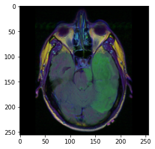
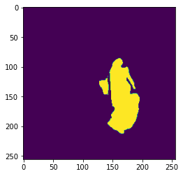

# Brain_Tumor_Segmentation

## Environment & Library
Python 3.6 is used for this project. You should create new virtual environments under identical conditions.
<pre>
<code>
$ conda create -n BTSegment python=3.6
$ conda activate BTSegment
</code>
</pre>

The requirements.txt file should list all Python libraries that your notebooks depend on, and they will be installed using:
<pre>
<code>
$ pip install -r requirements.txt
</code>
</pre>

## Dataset

Sampling data from Kaggle Dataset Brain MRI segmentation which gives MRI image and mask dataset of human brain.

You can download in Link: https://www.kaggle.com/mateuszbuda/lgg-mri-segmentation
